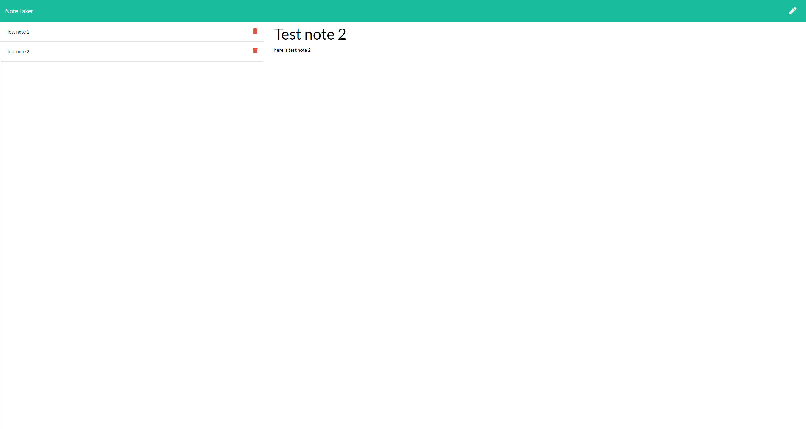

# **Note-Taker**   
## **In this weekly challenge, we were tasked with creating a back end and connecting it to the provided front end.  This note taking applicaiton will allow users to add, edit and delete notes.  This project was built using Node.js and Express.js**

## **Table of Contents**

* [Deployed Application](#deployed-application)

* [Screenshot](#screenshot)

* [Installation](#installation)

* [Features](#features)

* [Usage](#usage)

* [License](#license)

* [Badges](#badges)

* [Technology](#technology)

* [Contact](#contact-information)

## **Deployed Application**
https://note-taker-mwp.herokuapp.com/

## **Screenshot**

## **Installation**
undefined

## **Features**
This application features Node.js and Express.js.  This also utilizes the NPM UUID for creating randomly generated id numbers for each note created.

## **Usage**
This application can be used to enter, edit and delete user notes or tasks.

## **License**
(https://opensource.org/licenses/MIT)

## **Badges**

## **Technology**
HTML,CSS,Javascript,jQuery,Bootstrap,Node.js

## **Contact Information**
##### For questions or comments, please contact

* Github: (https://github.com/mwpx777)

* LinkedIn: (https://www.linkedin.com/in/mwpdesigns/)

* Email: (mwpx777@gmail.com)

